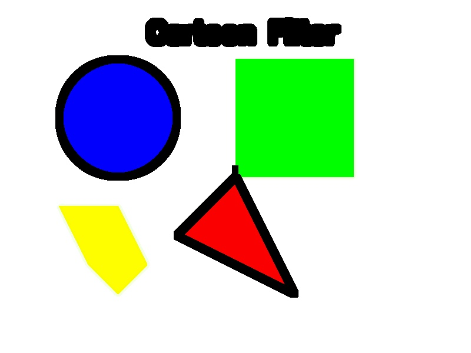

# Cartoon Filter Application


An advanced image processing application that transforms regular photographs into cartoon-style images using computer vision techniques.

<p align="center">
  
  
</p>

## Features

- **Multiple Edge Detection Methods**: Choose between Canny, Sobel, or Laplacian algorithms
- **Bilateral Filtering**: Preserve edges while smoothing textures
- **Intelligent Color Quantization**: K-means or uniform color reduction
- **Real-time Parameter Adjustments**: See changes as you make them
- **Style Presets**: Pre-configured settings for different cartoon styles
- **Comparison Views**: Side-by-side and process step visualization
- **Batch Processing**: Process multiple images with the same settings

## Demo

<p align="center">
  
  
</p>

## Installation

1. Clone this repository:
```bash
git clone https://github.com/taimoorkhan10/CartoonFilter.git
cd CartoonFilter
```

2. Install required packages:
```bash
pip install -r requirements.txt
```

## Usage

### GUI Application

To start the main application with full features:

```bash
python main.py
```

### Command Line Interface

For batch processing or automation:

```bash
python cli.py -i input_image.jpg -o output_image.png
```

Use `python cli.py --help` for more options and parameters.

## How It Works

The cartoon effect is created through several image processing steps:

1. **Edge Detection**: Identifies boundaries in the image using advanced algorithms
2. **Bilateral Filtering**: Smooths the image while preserving important edges
3. **Color Quantization**: Reduces the number of colors to create flat regions
4. **Color Enhancement**: Adjusts saturation to create vibrant cartoon-like colors

The combination of these techniques creates a customizable cartoon effect.

## Project Structure

- `app.py` - Main GUI application
- `cartoon_filter.py` - Core image processing functionality
- `preset_loader.py` - Handles saving and loading style presets
- `main.py` - Application entry point
- `cli.py` - Command-line interface
- `utils.py` - Helper functions and utilities
- `presets.json` - Pre-defined style configurations

## Available Presets

- **Default**: Balanced cartoon effect
- **Bold Lines**: Stronger outlines
- **Sketch**: Black and white drawing style
- **Minimal**: Simple style with fewer details
- **Vibrant**: Bright colors with medium lines
- **Comic**: Bold comic book style
- **Detailed**: More details and fine lines
- **Smooth**: Soft edges with simplified colors

## Contributing

Contributions are welcome! Please feel free to submit a pull request.

1. Fork the repository
2. Create your feature branch (`git checkout -b feature/amazing-feature`)
3. Commit your changes (`git commit -m 'Add some amazing feature'`)
4. Push to the branch (`git push origin feature/amazing-feature`)
5. Open a Pull Request

## License

This project is licensed under the MIT License - see the [LICENSE](LICENSE) file for details.

## Acknowledgments

- OpenCV for providing powerful image processing capabilities
- The Python community for excellent documentation and support
- Digital Image Processing researchers for the algorithms that make this possible

## Author

**Taimoor Khan** - [GitHub Profile](https://github.com/taimoorkhan10)

---

<p align="center">
Made with ❤️ for Digital Image Lab
</p> 